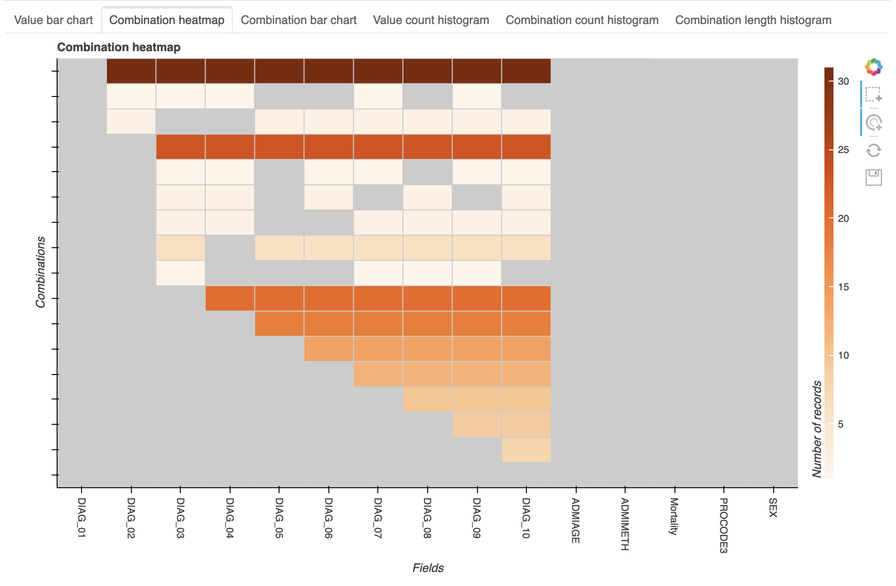

.. setvis documentation master file, created by
   sphinx-quickstart on Mon Nov 15 16:05:07 2021.
   You can adapt this file completely to your liking, but it should at least
   contain the root `toctree` directive.

Setvis Documentation Index
==========================

Setvis is a python package for exploring and visualizing data
missingness (that is, the presence, number and pattern of `missing
data <https://en.wikipedia.org/wiki/Missing_data>`_ in a dataset).

It can also be used to visualize set membership of which data
missingness is a special case.

The plotting and interactive workflow of Setvis (see :ref:`plots`) is
designed for use within a Jupyter notebook (although it is possible
to run outside Jupyter, see :ref:`plot_outside_notebook`).  The other
components of Setvis can be used interactively or programmatically.

At the moment, setvis can load data from `pandas
<https://pandas.pydata.org/>`_ dataframes, csv files, and also
supports a Postgres database backend.  It is designed with large
datasets in mind -- setvis may be able to load the missingness
information from a dataset even if the dataset itself does not fit
in memory.

Contents
========

.. toctree::
   :maxdepth: 2

   installation
   tutorials
   documentation
   api_reference

Introductory Example
====================

A quick example showing the output of setvis when run in a notebook.

See the :ref:`tutorials and example notebooks <tutorials>` for further
examples, and an explanation of the plots and user interface.

The output is an interactive widget in the notebook (the user has
chosen the 'combination heatmap' view - see
:meth:`setvis.plots.IntersectionHeatmap`). The selected data can be
refined by choosing elements of interest on the plot.

.. code-block:: python

   import pandas as pd
   from setvis.plots import PlotSession

   df = pd.read_csv("Synthetic_APC_DIAG_Fields.csv")

   session = PlotSession(df)

   session.add_plot(name="initial plot")

The combination heatmap shows the dataset’s fields (X axis), each combination of missing values (Y axis) and the number of records that are in each combination (colour). The most common combination is records that are missing nine fields (DIAG_02 - DIAG_10). The other six fields are never missing (DIAG_01, ADMIAGE, ADMIMETH, Mortality, PROCODE3, SEX).

Acknowledgements
================

The development of the setvis software was supported by funding from the
Engineering and Physical Sciences Research Council (EP/N013980/1;
EP/K503836/1) and the Alan Turing Institute.

Indices and tables
==================

* :ref:`genindex`
* :ref:`modindex`
* :ref:`search`
