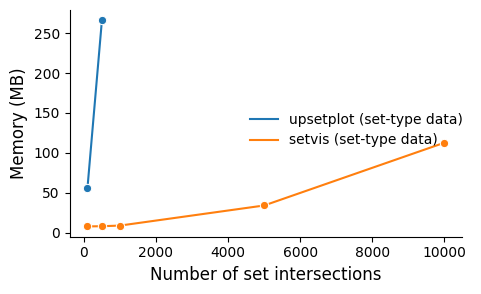

# Summary

Set-type data occurs in many domains (e.g., life sciences and the retail industry), as well as generic applications such as analyzing structures of missing data and association rule mining.
SetVis is a Python package which allows users to interact graphically as well as programmatically, uses a memory-efficient design, and may be used with datasets held in RAM or out of core (in a PostgreSQL database). A technical evaluation showed that SetVis uses a orders of magnitude less memory than UpSetPlot because the size of UpSetPlot's data structure is proportional to the number of rows \(\times\) columns in a dataset, and the difference is even greater for missing data analysis because for that UpSetPlot stores a duplicate copy of the dataset. We have used SetVis to reveal new insights about diagnostic persistence in hospital data for autism and we know it can be used in other research.

# Statement of need
Many data scientists adopt a visual analytic approach, using Jupyter Notebooks (or similar) to aid replicability.
The present paper describes new matrix-based set visualization software called \textit{SetVis}, which is implemented in Python and available from PyPi (https://pypi.org/project/setvis).
Unlike existing software, SetVis allows users to interact graphically in a notebook as well as programmatically, uses a memory-efficient architecture, and operates with datasets that may be either out of core or held in RAM. \textit{SetVis} is implemented in Python and is available from \textbf{https://github.com/alan-turing-institute/setvis}.
Our contributions are: (1) the SetVis design, (2) a technical evaluation that compares SetVis to UpSetPlot [@nothman2022] to quantify the improvement in memory efficiency, and (3) a case study that applied SetVis to reveal new insights about diagnostic persistence in hospital data for autism. Together this opens new potential for the use of set visualization in visual analytics.

# Design
Set membership information for each of $K$ sets can be represented with a mapping from an element (represented by its index) to a tuple of $K$ booleans based on indicator functions for each of these sets:

\begin{equation} \label{eq:members}
members: ElementIndex \to \{True, False\}^K.
\end{equation}

One component of the resulting tuple indicates membership of a particular set. Storing this mapping explicitly (e.g., as in UpSet with a dataframe [@conway2017upsetr,nothman2022]) requires $O(KN)$ storage, where $K$ and $N$ are the number of sets and the number of elements. When $K$ is large, as is the case for many real-world datasets, this can be inefficient.
The number of unique set intersections, $R$, is often much smaller than the number of records, $R \ll N$, and can be at most $N$ (if each element is member of a unique combination of sets). SetVis makes use of this idea, and considers
\begin{equation}
members = intersectionMembers \circ intersectionId
\end{equation}
where
\begin{equation}
intersectionId: ElementIndex \to IntersectionIndex
\end{equation}
maps an element index to an index referring to the particular combination of sets to which that element belongs; and
\begin{equation}
intersectionMembers: IntersectionIndex \to \{True, False\}^K
\end{equation}
is a bijection between an intersection index and the explicit representation of this combination.

In SetVis, these mappings are stored as a pair of Pandas dataframes (in an instance of the \textit{Membership} class), $intersectionId$ of size $O(N)$ and $intersectionMembers$ of size $O(RK)$, for a combined total of $O(N + RK)$ storage.

# Technical evaluation
We compared SetVis (v0.1.0) with UpSetPlot (v0.8.0)) based on two criteria: memory use and performance.
{UpsetR}[@conway2017upsetr] was not tested, but uses a similar data structure to UpSetPlot. The greatest difference between SetVis and UpSetPlot was in memory usage. For set-type data, SetVis only used 113 MB RAM for the largest dataset (500,000 rows; 11,000 sets; 10,000 intersections), whereas UpSetPlot required much more memory and crashed when the 500,000 row dataset contained more than 550 sets/500 intersections (see Figure~\ref{fig:set}). The difference was even more pronounced when the packages were used to analyze missing data. As expected with the planned missingness pattern, UpSetPlot's memory scaled linearly with the number of cells (i.e., rows \(\times\) columns) in a dataset, whereas SetVis's memory only increased gradually (see Figure~\autoref{fig:pm}). There was a similarly large difference between the packages for the general missingness pattern, because for missing data UpSetPlot keeps a copy of the input Pandas dataframe, as well as having a memory-hungry design.

# Case study

We had access to an anonymized Admitted Patient Care (APC) dataset, which contained a whole year's episodes (20 million). Space prevents an exhaustive description, complete with all the analysis dead ends. In this visual analytic case study, we investigated the circumstances under which diagnoses were lost from autistic patients (a condition that does not remit) in a 25,152 record EHR dataset. SetVis revealed two previously unknown patterns that account for the majority of the lost diagnoses. 

# Acknowledgements

This research was supported by the Alan Turing Institute. The
case study used a pseudonymized dataset from NHS Digital (NIC-
49164-R3G5K) that, due to data governance restrictions, cannot be
made openly available.

# References
