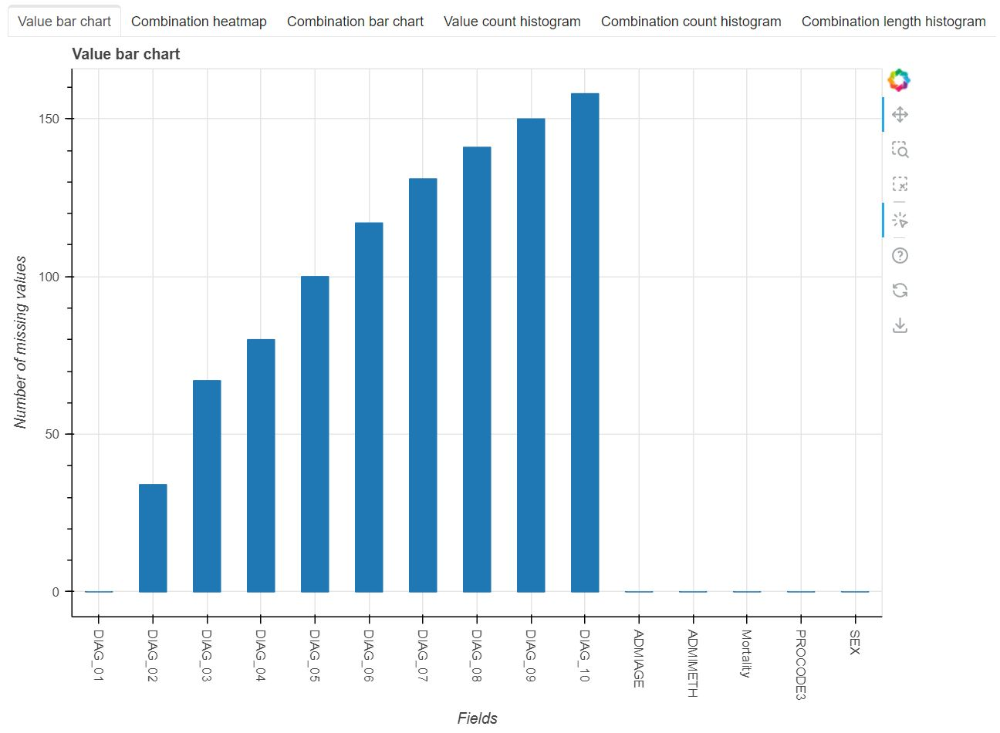
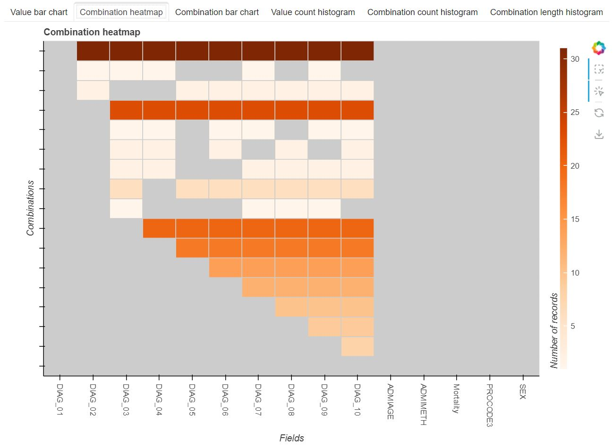
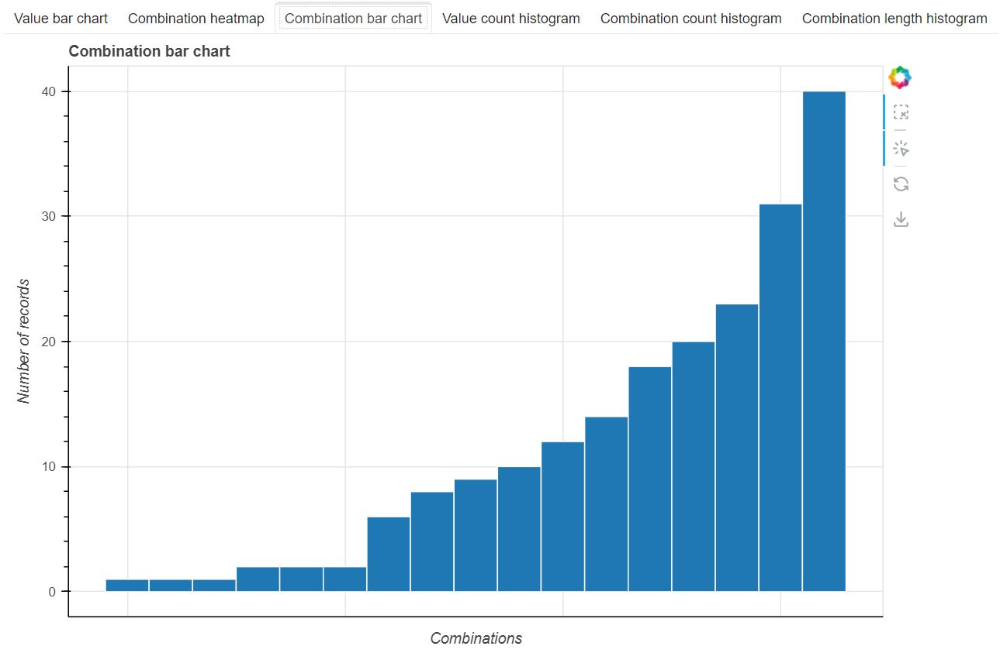
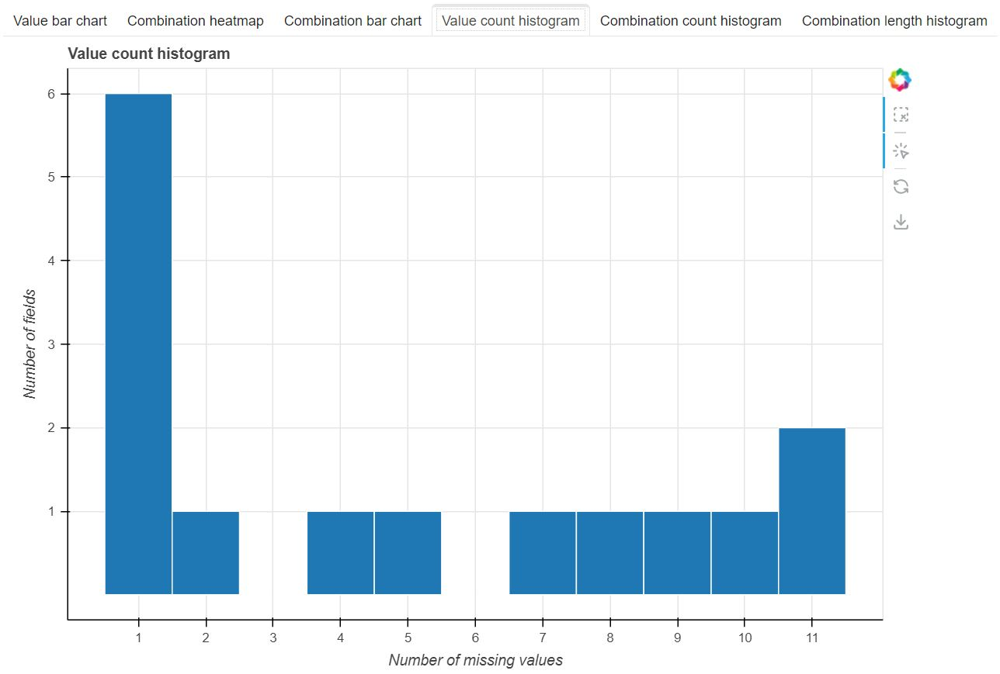
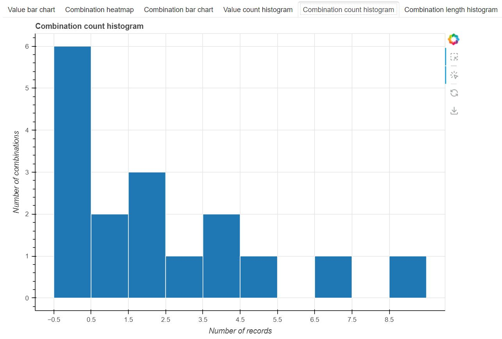
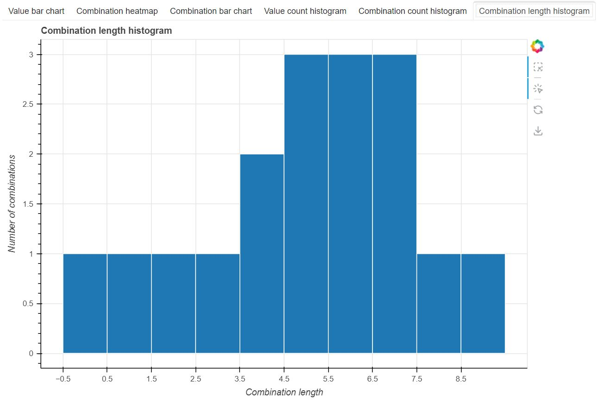

# Notebooks
The setvis package includes the following notebooks:

## Functionality examples
- [Example - import data to visualize missingness](https://github.com/alan-turing-institute/setvis/blob/main/notebooks/Example%20-%20import%20data%20to%20visualize%20missingness.ipynb) This shows how to visualize missing data directly from a file or from a dataframe.
- [Example - import data to visualize sets](https://github.com/alan-turing-institute/setvis/blob/main/notebooks/Example%20-%20import%20data%20to%20visualize%20sets.ipynb) This shows how to visualize set-type data directly from a file or from a dataframe.
- [Example - plotting outside the notebook and additional options](https://github.com/alan-turing-institute/setvis/blob/main/notebooks/Example%20-%20plotting%20outside%20the%20notebook.ipynb) This shows how to display setvis plots in a separate browser window or tab, rather than within a Jupyter notebook.
- [Example - methods of the Membership class](https://github.com/alan-turing-institute/setvis/blob/main/notebooks/Example%20-%20Membership%20class%20functionality.ipynb) This shows how to select records, columns and intersections from a Membership object.
- [Example - selection](https://github.com/alan-turing-institute/setvis/blob/main/notebooks/Example%20-%20selection.ipynb) This shows how to programmatically and interactively select columns in setvis visualizations.

## Tutorials
- [Tutorial 1 - Overview and an example analysis](https://github.com/alan-turing-institute/setvis/blob/main/notebooks/Tutorial%201%20-%20Overview%20and%20an%20example%20analysis.ipynb) Interactively analyse patterns of missing data, and use decision trees to explain certain patterns.
- [Tutorial 2 - Programmatic selection](https://github.com/alan-turing-institute/setvis/blob/main/notebooks/Tutorial%202%20-%20Programmatic%20selection.ipynb) Similar to Tutorial 1, but selects data programmatically instead of interactively.
- [Tutorial 3 (supplemental) - Create the Postgres database](https://github.com/alan-turing-institute/setvis/blob/main/notebooks/Tutorial%203%20(supplemental)%20-%20Create%20the%20Postgres%20database.ipynb) How to create a Postgres database for Tutorial 3.
- [Tutorial 3 - Loading data from Postgres](https://github.com/alan-turing-institute/setvis/blob/main/notebooks/Tutorial%203%20-%20Loading%20data%20from%20Postgres.ipynb) Similar to Tutorial 2, but loads data from a Postgres database.

## Other
- [Utility - Information Gain Ratio](https://github.com/alan-turing-institute/setvis/blob/main/notebooks/Utility%20-%20Information%20Gain%20Ratio.ipynb) This notebook defines and describes a function for computing the information gain ratio, used by Tutorials 2 and 3.

# Visualizations
There are six visualizations in setvis. These are described using [Example - import data to visualize missingness](https://github.com/alan-turing-institute/setvis/blob/main/notebooks/Example%20-%20import%20data%20to%20visualize%20missingness.ipynb).

The value bar chart shows the number of missing values (Y axis) in each field (X axis). The staircase of bars suggests that the DIAG_02 - DIAG_10 fields have a monotone pattern of missingness.

The combination heatmap shows the dataset’s fields (X axis), each combination of missing values (Y axis) and the number of records that are in each combination (colour). The top, 4th from top and bottom six combinations are a monotone pattern. However, the other seven combinations show that there is another pattern that has gaps in the DIAG fields.

The combination bar chart shows the number of records (Y axis) in each combination of missing values (X axis). There are 1 - 40 records in each combination.

The value count histogram shows the distribution of the number of missing values (X axis) and number of fields (Y-axis). This histogram setvis scale to datasets with many fields.

The combination count histogram shows the distribution of the number of records (X axis) and number of combinations of missing values (Y-axis). This histogram setvis scale to datasets with many fields.

The combination length histogram shows the distribution of the length (X axis) and number of combinations of missing values (Y-axis). This histogram setvis scale to datasets with many fields.

